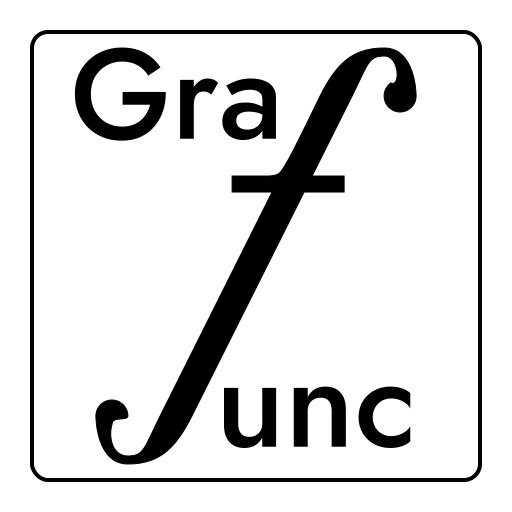

# Grafunc

    

## A simple graphing calculator

**Grafunc** is a simple graphing calculator programmed in the [Godot Engine](https://godotengine.org) using its built it programming language *GDScript*.

## Free and open source

This project is provided for free and open source under the  [GPL-3.0 license](LICENSE). Anyone may use, modify, and distribute Grafunc for commercial or private use (see the license for more information on permissions and limitations).

## How to get the program

Currently, there are no available executables due to the early prototype version. We will serve the first release once the program reaches version **0.1.0**.

Though, you can open and export the early development versions yourself by opening the *project.godot* file with the [Godot Engine](https://godotengine.org).
Currently using Godot version **4.2.2**, opening the project with earlier or later versions of Godot may result in errors and faults that are out of our control.

You may also open the **dev** branch of the this repo to get access to the latest work in progress. Do note that the **dev** branch will look and feel more unfinished than the **main** branch.

## Documentation

Documentation can be found on the [Website](https://docs.grafunc.com). The files can also be found under the [docs](docs/index.html) folder as a set of HTML files that can be opened in any browser.